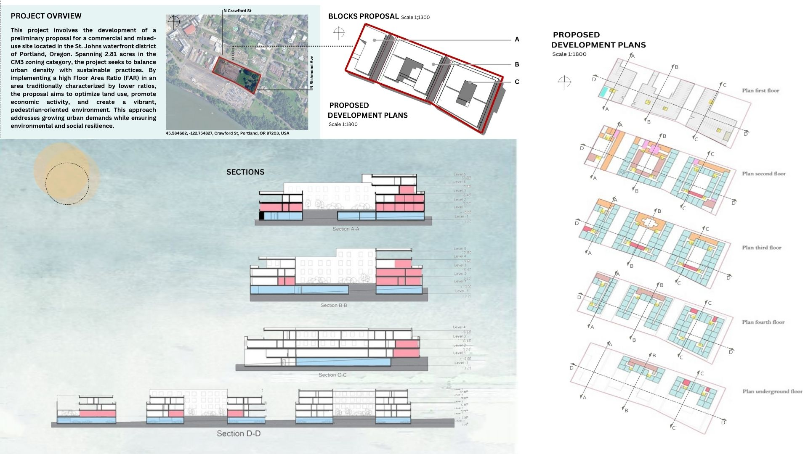
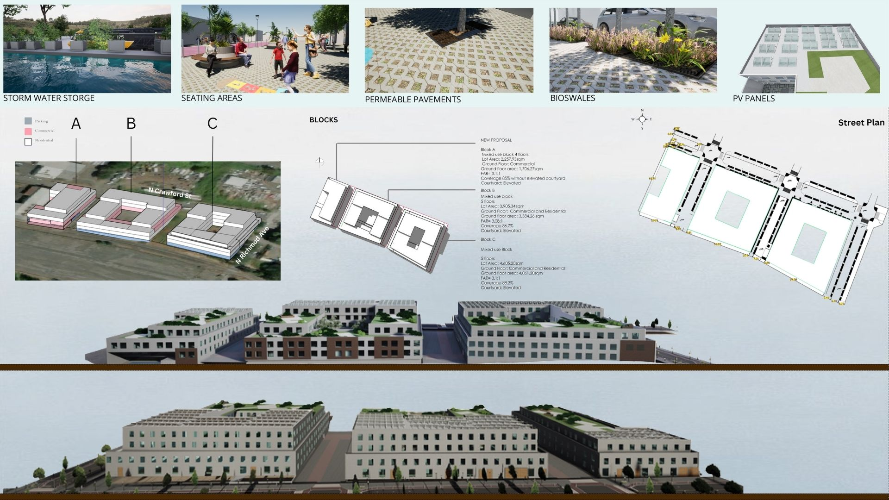
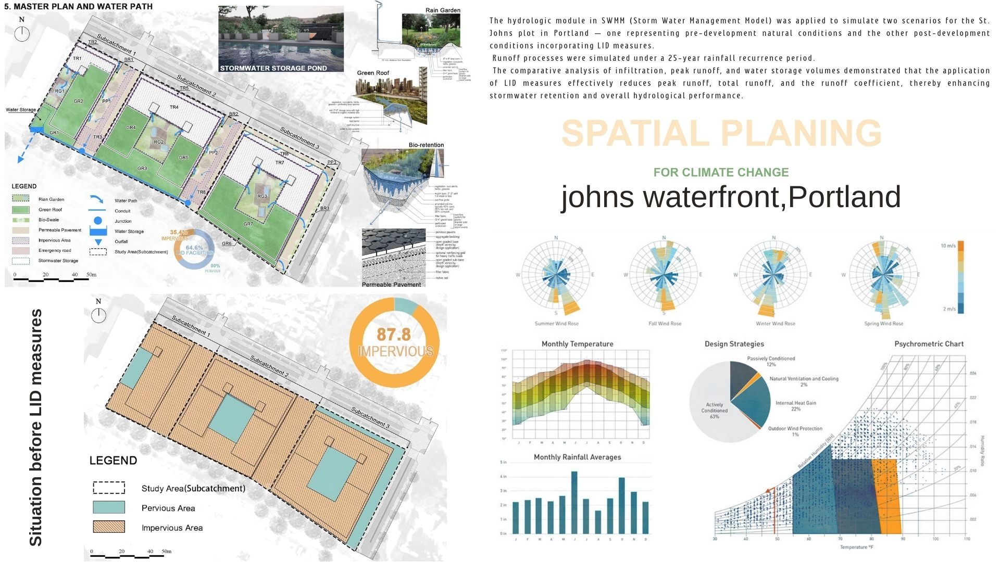
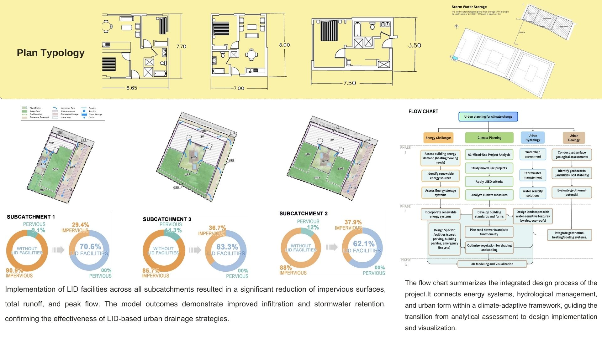

# Spatial Designing for Climate Adaptation  
### St. Johns Waterfront, Portland (OR), USA  

This project explores climate-adaptive urban design strategies for the St. Johns Waterfront district in Portland, Oregon.  
It integrates urban planning, hydrological modeling (SWMM), landscape design, climate analysis, and sustainable mixed-use development approaches.

---

## 📌 Project Overview  
The design focuses on transforming a **2.81-acre CM3-zoned site** into a pedestrian-oriented, climate-resilient urban district.  
Key goals include:

- Increasing density while maintaining environmental resilience  
- Integrating **LID (Low Impact Development)** stormwater strategies  
- Improving urban microclimate conditions through design interventions  
- Creating a vibrant, mixed-use, community-oriented environment  

---

## 🛠 Methods & Tools  

### Hydrological Modeling  
- Software: **SWMM**  
- Processes analyzed: infiltration, runoff, water storage  

### Urban Climate Analysis  
- Sun path  
- Wind rose  
- Psychrometric chart  

### Design Tools  
- Rhino / Grasshopper  
- Ladybug Tools  
- QGIS  

### Mapping & Visualization  
- GIS spatial analysis  
- Architectural layout studies  

---

## 🌧 Hydrological Modeling (SWMM)  

Two scenarios were simulated:

1. **Pre-development natural condition**  
2. **Post-development with integrated LID measures**

Results showed significant reductions in:

- Peak runoff  
- Total runoff volume  
- Runoff coefficient  

---

## 🌿 LID Strategies Applied  
- Permeable pavements  
- Bioswales  
- Bioretention areas  
- Stormwater storage pond  
- Green roof systems  

These measures enhanced **infiltration**, improved **stormwater retention**, and supported climate-adaptive design.

---

## 🏙 Urban & Architectural Design  
- Mixed-use block arrangement (A–B–C layout)  
- Commercial ground floors + residential upper floors  
- Solar optimization and shading analysis  
- Enhanced pedestrian network  
- Energy-adaptive community configuration  

---

## 📊 Climate Analysis Outputs  
Using Ladybug Tools:

- Monthly rainfall averages  
- Monthly temperature profile  
- Wind rose (summer, fall, winter, spring)  
- Psychrometric comfort analysis  
- Passive & active design strategies  

These informed layout orientation and façade design.

---

## Project Slides

### Page 1

### Page 2

### Page 3

### Page 4

## 👩‍💻 Author  
**Farimah Dabiri**  
MSc Urban & Regional Planning  
Politecnico di Torino  

---

